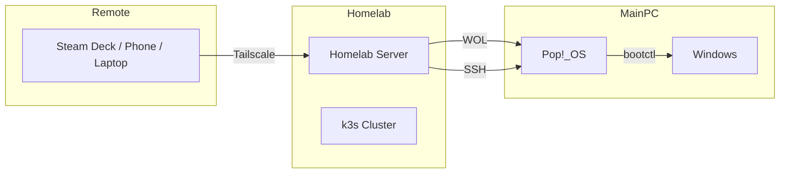

# 🏠 Homelab Kubernetes

A self-hosted Kubernetes environment for homelab computing, gaming, and learning DevOps.

---

## What's Here

| Component | Description |
|-----------|-------------|
| **k3s Cluster** | Lightweight Kubernetes on Debian |
| **Minecraft Server** | Modded Java Edition with friends |
| **Headless WOL** | Remote boot/maintain a gaming PC via homelab |
| **VPN Access** | Tailscale for secure remote access |

---

## Architecture



---

## Quick Start

```bash
# Minecraft server
kubectl apply -f apps/minecraft-server/deployment/

# Headless WOL (see docs/guides/headless-wol-guide.md)
wol-pc status
```

---

## 📁 Structure

```md
homelab-k8s/
├── apps/              # Kubernetes manifests
│   └── minecraft-server/
├── scripts/           # Helper scripts (wol-pc, etc.)
├── docs/
│   ├── guides/       # How-to tutorials
│   ├── howto/        # Technical reference
│   └── plans/        # Internal runbooks
└── infrastructure/   # Core configs
```

---

## 📖 Documentation

- **[Guides](./docs/guides/)** — Step-by-step tutorials
- **[Headless WOL](./docs/guides/headless-wol-overview.md)** — Remote boot gaming PC
- **[k3s Setup](./docs/guides/k3s-setup.md)** — Cluster configuration

---

## 🔧 Getting Started

See [docs/guides/k3s-setup.md](./docs/guides/k3s-setup.md) for cluster setup.
