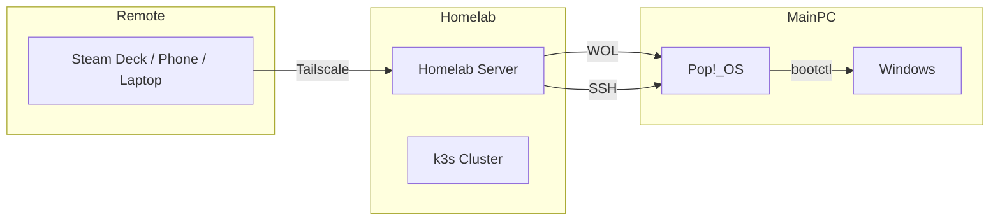

# 🏠 Homelab Kubernetes

A self-hosted Kubernetes environment for homelab computing, gaming, and learning DevOps.

---

## What's Here

| Component | Description |
|-----------|-------------|
| **k3s Cluster** | Lightweight Kubernetes on Debian |
| **Minecraft Server** | Modded Java Edition with friends |
| **Headless WOL** | Remote boot/maintain a gaming PC via homelab |
| **VPN Access** | Tailscale for secure remote access |
| **Vaultwarden** | Self-hosted Bitwarden-compatible password manager (suspended, ClusterIP-only, no public ingress) |
| **GitOps / Flux** | Flux manages **ai-trade** and **Vaultwarden** (both migration scaffolding, both suspended); native homelab workloads remain manual for now |

---

## Architecture


```mermaid
flowchart LR
    subgraph Remote
        Device[Steam Deck / Phone / Laptop]
    end

    subgraph Homelab
        HomelabNode[Homelab Server]
        K8s[k3s Cluster]
    end

    subgraph MainPC
        Linux[Pop!_OS]
        Windows[Windows]
    end

    Device -- Tailscale --> HomelabNode
    HomelabNode -- WOL --> Linux
    HomelabNode -- SSH --> Linux
    Linux -- bootctl --> Windows
```

---

## Quick Start

```bash
# Minecraft server
kubectl apply -f apps/minecraft-server/deployment/

# Headless WOL (see docs/guides/headless-wol-guide.md)
wol-pc status
```

---

## 📁 Structure

```md
homelab-k8s/
├── apps/               # Legacy/pre-GitOps Kubernetes manifests
│   └── minecraft-server/
├── clusters/           # Flux bootstrap root and cluster identity
│   └── homelab/        # Physical/logical k3s cluster identity
│       ├── aitrade/          # ai-trade Flux integration resources
│       ├── secrets/          # SOPS-encrypted secrets
│       ├── aitrade-flux.yaml # Flux Kustomization for ai-trade
│       ├── vaultwarden.yaml  # Flux Kustomization for vaultwarden
│       └── node-labels.md    # Node placement documentation
├── infrastructure/     # Native cluster service workload manifests
│   ├── vaultwarden/    # Vaultwarden password manager
│   ├── access/         # Access control resources
│   ├── bore-server/    # Bore tunnel server
│   ├── gpu-feature-discovery/
│   ├── keycloak/       # OIDC identity provider
│   └── monitoring/     # Cluster monitoring stack
├── scripts/            # Helper scripts (wol-pc, etc.)
└── docs/               # Documentation
    ├── guides/
    ├── howto/
    ├── plans/
    └── runbooks/
```

---

## 📖 Documentation

- **[Guides](./docs/guides/)** — Step-by-step tutorials
- **[Headless WOL](./docs/guides/headless-wol-overview.md)** — Remote boot gaming PC
- **[k3s Setup](./docs/guides/k3s-setup.md)** — Cluster configuration
- **[Flux Setup](./docs/guides/flux-setup.md)** — Flux bootstrap and SOPS setup
- **[SOPS Secrets](./docs/howto/sops-secrets.md)** — Encrypted secret management
- **[Flux Cutover](./docs/runbooks/flux-cutover.md)** — Staged ai-trade Flux migration
- **[Vaultwarden Runbook](./docs/runbooks/vaultwarden.md)** — Password manager setup and ops
- **[Flux Move Plan](./docs/plans/flux-move.md)** — Decision log and architecture
- **[Node Labels](./clusters/homelab/node-labels.md)** — Node pool placement strategy

---

## 🔧 Getting Started

See [docs/guides/k3s-setup.md](./docs/guides/k3s-setup.md) for cluster setup.
