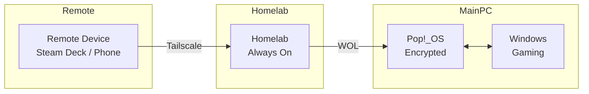

# Headless WOL — Overview

Remote boot and control a gaming/ML PC from a homelab, with seamless Linux/Windows switching.

---

## What It Does

| Capability | Description |
|------------|-------------|
| **Wake on LAN** | Power on a fully shutdown (S5) PC from the homelab |
| **Remote LUKS Unlock** | Decrypt full-disk encryption headlessly via SSH during boot |
| **Dual-Boot Control** | Boot into Pop!_OS or Windows remotely |
| **Gaming via Steam Link** | Windows auto-logs into a dedicated steam account |
| **Kubernetes Ready** | PC joins k3s as a GPU worker when on Linux |

---

## Usage

```bash
wol-pc linux            # Wake from off → boot Pop!_OS
wol-pc windows          # Wake from off → boot Pop!_OS → reboot to Windows
wol-pc switch_to_windows  # Already on Linux → reboot directly to Windows
wol-pc shutdown         # Graceful shutdown
wol-pc status          # Check if PC is reachable
```

---

## Architecture



---

## Key Components

- **WOL** — Magic packet sent from homelab to wired NIC
- **Dropbear in initramfs** — Lightweight SSH server during early boot
- **passfifo** — Method to inject LUKS passphrase via SSH
- **systemd-boot one-shot** — Select Windows for one boot only
- **Steam auto-login** — Windows logs into dedicated steam account

---

## Related

- [Headless WOL Guide](./headless-wol-guide.md) — How to build this
- [Runbook](../plans/headless-wol-runbook.md) — Internal implementation details
